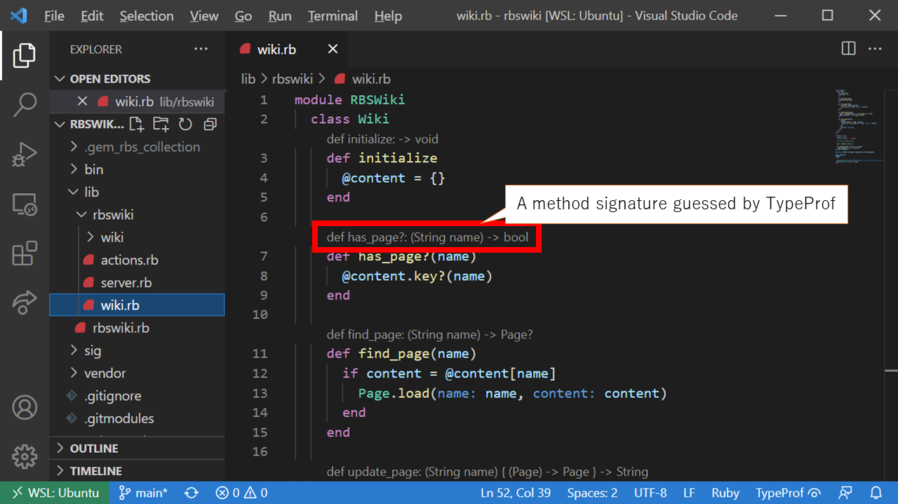
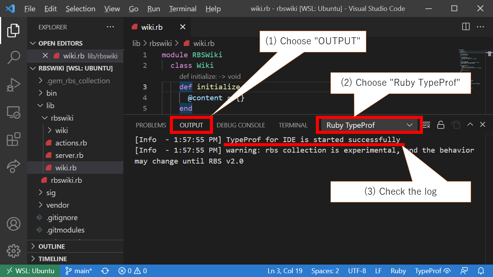

# How to use TypeProf for IDE

First, try it with an already-configured repository!

1. `rbenv install 3.1.0-dev`
2. `git clone https://github.com/mame/rbswiki.rb`
3. `git clone https://github.com/ruby/typeprof`
4. `cd rbswiki && bundle install`
5. `rbs collection install`
6. install [VSCode extension for TypeProf](https://marketplace.visualstudio.com/items?itemName=mame.ruby-typeprof) to your VSCode
7. open the `rbswiki` folder by VSCode
8. open `lib/rbswiki/wiki.rb`

If everything goes well, you will see guessed signatures for each method:



### Troubleshooting

* Make sure that you are using ruby 3.1.0-dev.

```
$ ruby -v
ruby 3.1.0dev (2021-09-28T11:03:54Z master 545e01645f) [x86_64-linux]
```

* Check if typeprof version is 0.20.0 or later.

```
$ bundle exec typeprof --version
typeprof 0.20.0
```

* Check if TypeProf can analyze `lib/rbswiki/wiki.rb` within one second.

```
$ bundle exec typeprof lib/rbswiki/wiki.rb
warning: rbs collection is experimental, and the behavior may change until RBS v2.0
# TypeProf 0.20.0

# Classes
module RBSWiki
  class Wiki
    @content: Hash[String, String]
...
```

* See the log of "Ruby TypeProf" in vscode's "OUTPUT" panel.



## How to configure TypeProf for your code

1. Write `gem "typeprof"` to your `Gemfile`, and run `bundle install`
2. Write `rbs_collection.yaml`, and run `rbs collection install`
3. Test if TypeProf works well by running `bundle exec typeprof your_code.rb`
4. Open your repository with vscode

### Troubleshooting

*TBD*

## Protips, limitation, unimplemented features, ...

TypeProf for IDE is extremely preliminary! Please give it a try with a warm heart...

* Write a simple (type-level) test in each file with `if $0 == __FILE__` guard to guide TypeProf to infer method signatures.
* Use `require` only for loading gems. To load your code, use `require_relative` instead of `require`. (Or, create `bin/typeprof` and pass `-Ilib`. TBD for details)
* Currently, TypeProf for IDE loads `typeprof.rbs` at the top folder. (I'll need to improve it to read `sig/` directory)
* TypeProf for IDE analyzes each file within one second. Unfortunately, it takes very long to analyze big code, or complex code, or code that requires a big gem. In this case, TypeProf for IDE cannot show any guesses. Splitting a file or manually writing RBS may make the analysis faster. (TBD for details)
* Unfortunately, TypeProf may report some false positive errors that you cannot stop. I'll create an option to configure error level.
* TypeProf for IDE tries to invoke TypeProf as follows:
    * If your repository has `bin/typeprof` executable, it is invoked.
    * Otherwise, it will try to invoke a command specified in VS`typeprof.server.path`.
    * Otherwise, it will try to invoke `bundle exec typeprof`.
    * Otherwise, it will try to invoke `typeprof`.
    * Otherwise, TypeProf for IDE gives up.
* Some people says TypeProf for IDE works with vim! (TBD for details)

## How to develop TypeProf for IDE

See `../vscode/development.md`.
